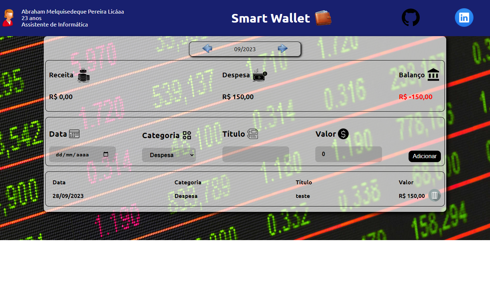

# Smart Wallet 🧠👜

Smart Wallet é um sistema de finanças que visa facilitar o controle das dívidas/salários ao decorrer dos meses do ano.

Funcionalidades inclusas:

- Armazenamento de dados no local storage (dados não são apagados ao sair e entrar do navegador)
- Tela de Login
- Adicionar e excluir finanças
- Verificar finanças de outros meses do ano

# Tecnologias usadas

- Javascript (React) 
- Styled Components (estilização)
- Typescript

## Autor

- [@AbrahamLica](https://www.github.com/AbrahamLica)  👈

## Social
- [Perfil Linkedin ](https://www.linkedin.com/in/abraham-melquisedeque-pereira-lic%C3%A1-0a1736203/) 👈

<h3>Screenshot</h3>

